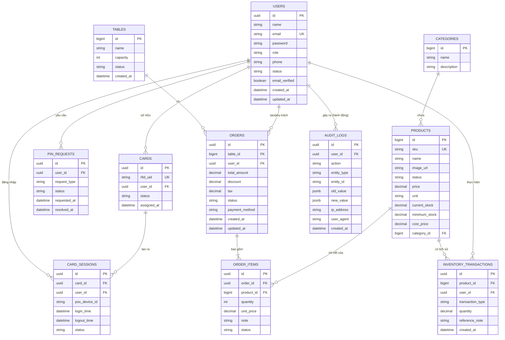

# Thiết Kế Cơ Sở Dữ Liệu - ViePOS F&B Management System

Dựa trên các chức năng của hệ thống (dành cho Admin và Nhân viên phục vụ POS), cơ sở dữ liệu được thiết kế thành các cụm module: **Người dùng & Xác thực**, **Thực đơn & Hàng hóa**, **Bàn & Đơn hàng**, **Quản lý Kho**, và **Audit Log (Lưu vết hệ thống)**.

## 1. Sơ đồ thực thể liên kết (ER Diagram)

---

## 2. Chi tiết các bảng (Tables Details)

### 2.1. Module Người dùng & Xác thực (Users & Auth)

**Bảng `users`** (Tài khoản nhân viên, admin)
- `id` (UUID, PK): Mã người dùng.
- `name` (String): Tên hiển thị.
- `email` (String, UK): Email đăng nhập.
- `password` (String): Mật khẩu băm (Hashed password).
- `role` (Enum): Vai trò (VD: `ADMIN`, `MANAGER`, `STAFF`).
- `phone` (String): Số điện thoại.
- `status` (Enum): Trạng thái (VD: `PENDING`, `ACTIVE`, `BLOCKED`).
- `email_verified` (Boolean): Xác nhận email.
- `created_at`, `updated_at` (Timestamp).

**Bảng `cards`** (Thẻ RFID/NFC cho nhân viên POS)
- `id` (UUID, PK): Mã quản lý thẻ.
- `rfid_uid` (String, UK): Mã định danh chip RFID/NFC đọc được từ phần cứng.
- `user_id` (UUID, FK): Nhân viên được cấp thẻ.
- `status` (Enum): `ACTIVE`, `LOST`, `REVOKED`.
- `assigned_at` (Timestamp): Ngày cấp.

**Bảng `card_sessions`** (Phiên đăng nhập tại máy POS)
- `id` (UUID, PK): ID phiên bản.
- `card_id` (UUID, FK): Thẻ được dùng.
- `user_id` (UUID, FK): Nhân viên tương ứng.
- `pos_device_id` (String): Định danh của thiết bị tính tiền (Tablet/POS).
- `login_time` (Timestamp): Thời gian quẹt thẻ vào ca.
- `logout_time` (Timestamp): Thời gian quẹt thẻ ra ca.
- `status` (Enum): `ACTIVE`, `COMPLETED`.

**Bảng `pin_requests`** (Yêu cầu đổi mã PIN dành cho thẻ POS)
- `id` (UUID, PK).
- `user_id` (UUID, FK).
- `request_type` (Enum): `CHANGE`, `RESET`.
- `status` (Enum): `PENDING`, `APPROVED`, `REJECTED`.
- `requested_at`, `resolved_at` (Timestamp).

### 2.2. Module Thực đơn (Menu / Catalog)

**Bảng `categories`** (Danh mục món)
- `id` (BigInt, PK).
- `name` (String): Tên danh mục (VD: Cà phê, Trà sữa).
- `description` (String): Mô tả.

**Bảng `products`** (Sản phẩm/Thành phẩm)
- `id` (BigInt, PK).
- `sku` (String, UK): Mã sản phẩm (Mã vạch).
- `name` (String): Tên sản phẩm.
- `image_url` (String): Link ảnh minh họa.
- `status` (String): Trạng thái ("Đang bán", "Dừng bán").
- `price` (Decimal): Giá bán hiện tại.
- `unit` (String): Đơn vị tính (VD: cái, chai, lon).
- `current_stock` (Decimal): Tồn kho hiện tại.
- `minimum_stock` (Decimal): Tồn kho tối thiểu (Cảnh báo khi sắp hết).
- `cost_price` (Decimal): Giá vốn trung bình nhập vào.
- `category_id` (BigInt, FK): Thuộc danh mục nào.

### 2.3. Module Bàn & Đơn hàng (Tables & Orders)

**Bảng `tables`** (Quản lý khu vực bàn)
- `id` (BigInt, PK).
- `name` (String): Tên bàn (VD: Bàn 1, Bàn 2, T1-01).
- `capacity` (Int): Số chỗ ngồi.
- `status` (Enum): `AVAILABLE` (Trống), `OCCUPIED` (Có khách), `RESERVED` (Đã đặt).

**Bảng `orders`** (Đơn hàng)
- `id` (UUID, PK): Mã đơn hàng.
- `table_id` (BigInt, FK): Đơn hàng thuộc bàn nào (có thể null nếu mua mang đi/Takeaway).
- `user_id` (UUID, FK): Nhân viên phục vụ/tạo đơn.
- `total_amount` (Decimal): Tổng tiền cần thanh toán.
- `discount` (Decimal): Tiền giảm giá.
- `tax` (Decimal): Thuế VAT.
- `status` (Enum): `PENDING` (Đang chọn món), `PROCESSING` (Đang chế biến), `COMPLETED` (Đã thanh toán), `CANCELLED` (Hủy).
- `payment_method` (Enum): `CASH`, `CREDIT_CARD`, `MOMO`, `BANK_TRANSFER`.
- `created_at`, `updated_at` (Timestamp).

**Bảng `order_items`** (Chi tiết các món trong 1 đơn hàng)
- `id` (UUID, PK).
- `order_id` (UUID, FK): Thuộc đơn hàng nào.
- `product_id` (BigInt, FK): Sản phẩm nào.
- `quantity` (Int): Số lượng.
- `unit_price` (Decimal): Giá tại thời điểm đặt (để tránh thay đổi giá gốc làm sai lệch lịch sử).
- `note` (String): Ghi chú của khách (VD: "Ít đá", "Không đường").
- `status` (Enum): `PREPARING` (Đang làm), `READY` (Xong), `DELIVERED` (Đã giao khách).

### 2.4. Module Quản lý Kho (Inventory)

*(Hệ thống nhập trực tiếp thành phẩm về để bán, không quản lý nguyên liệu rời)*

**Bảng `inventory_transactions`** (Lịch sử Nhập/Xuất/Kiểm kho)
- `id` (UUID, PK).
- `product_id` (BigInt, FK): Mã sản phẩm.
- `user_id` (UUID, FK): Người thực hiện thao tác (quản lý kho).
- `transaction_type` (Enum): `IMPORT` (Nhập), `EXPORT` (Xuất), `ADJUSTMENT` (Điều chỉnh kiểm kho), `SALE_DEDUCTION` (Trừ tự động khi bán hàng).
- `quantity` (Decimal): Số lượng thay đổi (dương hoặc âm).
- `reference_note` (String): Mã phiếu hoặc ghi chú (VD: "Nhập hàng từ NCC A").
- `created_at` (Timestamp).

### 2.5. Lịch sử Hệ thống (Audit Log)

*Hệ thống cần theo dõi mọi thao tác quan trọng (thêm, sửa, xóa, cấp quyền, hủy đơn, nhập kho) nhằm mục đích bảo mật, truy vết.*

**Bảng `audit_logs`**
- `id` (UUID, PK).
- `user_id` (UUID, FK): Người dùng thực hiện thao tác (Tài khoản admin/staff).
- `action` (String): Tên hành động (VD: `CREATE_USER`, `DELETE_PRODUCT`, `CANCEL_ORDER`, `UPDATE_INVENTORY`).
- `entity_type` (String): Tên bảng bị tác động (VD: `users`, `products`, `orders`).
- `entity_id` (String): ID của bản ghi bị tác động (lưu String để có thể chứa cả UUID và BigInt).
- `old_value` (JSONB): Trạng thái dữ liệu *trước* khi sửa/xóa.
- `new_value` (JSONB): Trạng thái dữ liệu *sau* khi thêm/sửa.
- `ip_address` (String): Địa chỉ IP thực hiện.
- `user_agent` (String): Trình duyệt / Thiết bị.
- `created_at` (Timestamp): Thời gian thực hiện.

---

## 3. Các ràng buộc và chính sách dữ liệu (Data Integrity)

1. **Ràng buộc khóa ngoại (Foreign Keys):** 
   - Hầu hết các ràng buộc nên cài đặt quy tắc `ON DELETE RESTRICT` (Không cho xóa nếu có dữ liệu phụ thuộc) để đảm bảo lịch sử đơn hàng, kho không bị mất mát khi lỡ tay xóa một sản phẩm hay một nhân viên.
   - Đối với tài khoản hoặc sản phẩm ngừng kinh doanh, dùng phương pháp **Soft Delete** (Cập nhật cột `status = 'INACTIVE'` hoặc `status = 'Dừng bán'`).
2. **Audit Log Tự động:** Các Trigger tại Database hoặc Middleware tại Backend sẽ tự động bắt sự kiện Insert/Update/Delete tại các bảng cấu hình để lưu vào `audit_logs`.
3. **Transaction Kho:** Khi trạng thái Order đổi sang `COMPLETED`, backend sẽ tự động dựa vào `order_items` để insert vào `inventory_transactions` với `type = 'SALE_DEDUCTION'` và trừ `current_stock` trực tiếp trên bảng `products`.
